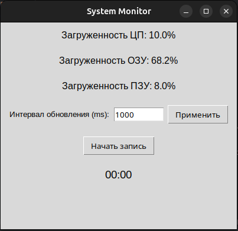
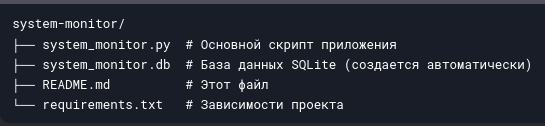

# System Monitor


**System Monitor** — это desktop-приложение для мониторинга загруженности системы в реальном времени. Оно отображает
уровень использования ЦП, ОЗУ и ПЗУ, а также позволяет записывать эти данные в базу данных SQLite.

## Возможности

- 📊 **Мониторинг в реальном времени**: Отображение загруженности ЦП, ОЗУ и ПЗУ.
- ⏱️ **Таймер записи**: Время записи отображается в формате `MM:SS`.
- 💾 **Запись в базу данных**: Данные сохраняются в SQLite для дальнейшего анализа.
- 🎛️ **Настройка интервала обновления**: Пользователь может задать интервал обновления данных (минимум 1 секунда).

## Скриншоты

  
*Интерфейс System Monitor.*

### Требования

- Python 3.8 или выше
- Библиотека `psutil` 
- Библиотека `tkinter`

### Установка

1. Клонируйте репозиторий:
   ```bash
   git clone https://github.com/Odiosus/system-monitor.git

1. Создайте виртуальное окружение и активируйте его:
   ```bash
   python3 -m venv .venv 
   source .venv/bin/activate

1. Установите необходимые зависимости:
   ```bash
   pip install -r requirements.txt

## Запуск приложения

   ```bash 
   python3 system_monitor.py 
   ```

## Использование

1. Интерфейс:

- Приложение отображает текущую загруженность ЦП, ОЗУ и ПЗУ.
- Поле "Интервал обновления (ms)" позволяет задать интервал обновления данных (в миллисекундах).

2. Запись данных:

- Нажмите кнопку "Начать запись", чтобы начать сохранение данных в базу данных.
- Нажмите кнопку "Остановить", чтобы прекратить запись.

3. Таймер:

- Во время записи отображается таймер, показывающий время с начала записи.

4. База данных:
- Данные сохраняются в файл `system_monitor.db` в текущей директории.
- Просмотреть данные с помощью SQLite-клиента: 
```bash 
   sqlite3 system_monitor.db 
   ```
Запрос для просмотра данных:
```bash 
   SELECT * FROM system_metrics;
   ```

## Структура проекта

  
